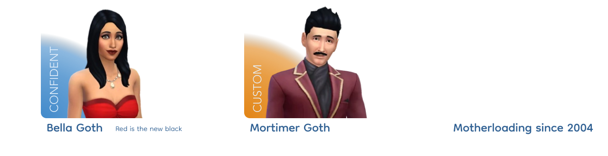
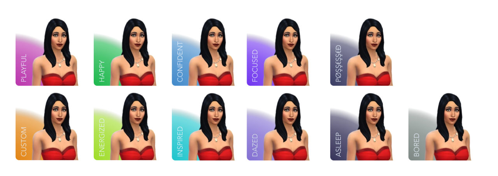

# A simple Sims 4 inspired theme for your tumblr

## ✨ Features and options
- One column
- Post sizes: 540px
- Customizable Primary color (Header background, Post background, Live mode controls background)
- Customizable Accent color (Text, Icons)
- Customizable Background: Image or Solid color
- Header (optional)
- Navigation (optional)

### Special feature — Sims Emotion 

|                      |                                                                                                   |
|----------------------|---------------------------------------------------------------------------------------------------|
| 🕵️ Who's that Sim?   | Add your name and extremly short bio (or whatever you want)                                       |
| 📸 Show your Simself | Upload an image of your simself or anything really (png, transparent background, 240px by 240px)  |
| 🫥 Pick an emotion!  | Choose between 10 premade emotions or make you own!                                               |

## 🔮 Coming ~~soon~~ maybe
- [ ] About Page — a CAS inspired page
- [ ] Hub Page — a World selection inspired page
- [ ] Custom Navigation
- [ ] Mobile friendly version

## 🔧 Installation
1. Go to the `theme-sims4.html` file
2. Copy its content
3. Paste the content in the Tumblr Customizer
4. Save
5. Customize the options if needed
6. Enjoy 🎉

> Lost ? Here's an [in-depth guide](https://quickguide.tumblr.com/post/34349589516/how-to-install-tumblr-theme-code)

## 🆘 Troubleshooting
> This is my first Tumblr Theme, if you encounter any bug be sure to contact me on [my tumblr](https://commedessims.tumblr.com/) and I'll see what I can do!

  
The options aren't applied

  Toggle the options on and off, it should work properly after!

